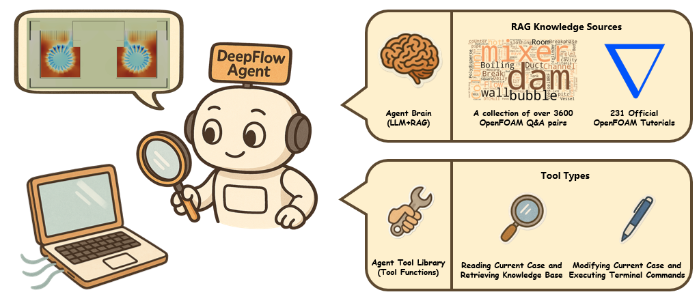
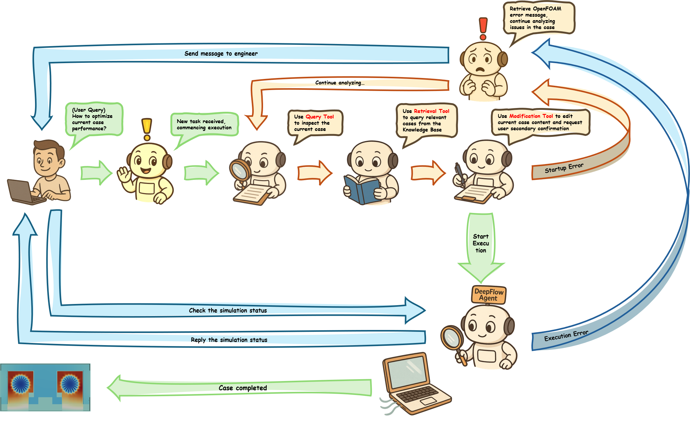
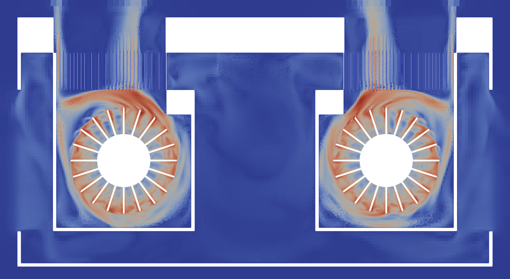
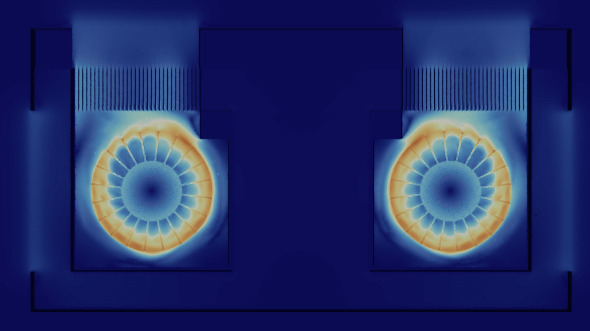
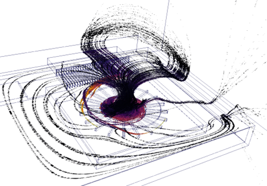
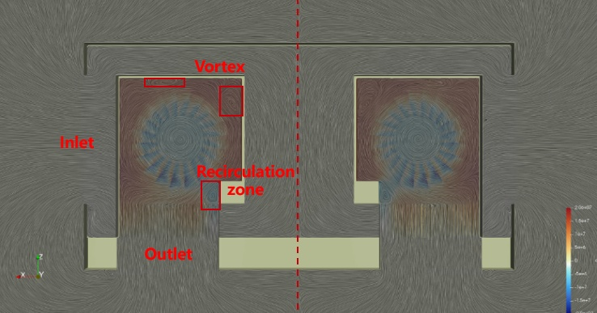

# DeepFlow - 智能计算流体动力学助手

[](https://www.python.org/downloads/)
[](https://www.openfoam.com/)
[](https://www.riverbankcomputing.com/software/pyqt/)
[](https://python.langchain.com/)

## 📖 项目简介

DeepFlow 是一个计算流体动力学（CFD）智能助手系统，采用 "Think-Act" 范式，集成了 OpenFOAM 求解器、RAG（检索增强生成）技术和现代化的图形用户界面。该系统旨在打破传统 CFD 仿真中高专业门槛的壁垒，帮助工程师和研究人员通过自然语言交互，更高效地进行仿真分析、参数调优、结果可视化及问题诊断。

🏆 本项目荣获 **第三届全国大学生智能终端仿真技术大赛（专业赛道）二等奖**。

> ⚠️ **开源说明**：由于本项目涉及的完整 CFD 算例文件（包含网格与瞬态数据）体积巨大，本仓库当前**仅开源 Agent（智能体）部分**的核心代码与架构实现。

<div align="center">
  
</div>

## ✨ 主要特性

* 🤖 **智能 AI 助手**: 基于 LangChain 和大型语言模型构建的智能对话系统，支持自然语言驱动的仿真全流程控制。
* 🔍 **RAG 检索系统**: 集成 FAISS 向量数据库，挂载专业知识库，确保 AI 回答的专业性与准确性。
* 🖥️ **现代化 GUI**: 基于 PyQt5 开发的直观图形界面，集成了参数配置、求解器控制及 3D 可视化窗口 。
* 📊 **实时监控与后处理**: 集成 Matplotlib 与 PyVista，支持残差曲线实时跟踪、流率监测。

## 🔄 智能体工作流

DeepFlow Agent 采用基于 ReAct 框架的决策循环，将复杂的 CFD 仿真流程转化为 "感知-规划-执行" 的自动化任务。

<div align="center">
  
</div>

1.  **意图识别**: 用户通过自然语言输入仿真需求（如“运行瞬态计算并监测出口流量”）。
2.  **知识检索 (RAG)**: Agent 自动检索 OpenFOAM 配置规则及案例库，辅助修改配置文件。
3.  **工具调用**: 智能体通过工具集（Toolset）自动执行文件读写、网格转换、求解器启动等操作，并实时解析 Log 文件反馈仿真状态。

## 💻 APP 界面与交互

系统界面设计遵循工程师操作习惯，将 AI 对话与专业仿真控制面板深度融合 。

<div align="center">
  
</div>

* **对话交互区**: 用户在此发送指令，AI 实时反馈操作结果及建议。
* **可视化面板**: 支持网格预览及流场云图的快速查看。
* **实时监控**: 动态绘制残差与流量曲线，帮助用户判断收敛性。

## 🧪 仿真结果展示

本项目以笔记本电脑双风扇散热系统为案例。

### 1. 流场特性分析
系统成功捕捉了双风扇对转系统中的复杂流动特征。稳态仿真显示最大流速达到 **11.77 m/s**，瞬态结果清晰展示了叶片周边的周期性脉动与涡脱落现象。

<div align="center">

| 稳态速度场 | 瞬态速度场 |
| :---: | :---: |
|  |  |

</div>


### 2. 流线与拓扑结构
通过流线追踪，清晰呈现了气流在叶轮吸力作用下的螺旋运动轨迹及出口处的整流效应。

<div align="center">
  
</div>

### 3. 局部流场结构
通过按压力着色的截面流线图（LIC），我们可以清晰地识别出风扇壳体内部的关键流动特征 。
* **强吸力区**: 进气口附近的流线呈现显著的向内弯曲，反映了叶轮强大的吸力机制。
* **涡旋与回流**: 图中清晰捕捉到了壳体附近的复杂涡旋结构和回流区。这些局部的不稳定流动现象被认为是系统气动噪声产生的主要来源。

<div align="center">
  
</div>

## 🏗️ 项目结构

```

DeepFlow/
├── deepflow_agent/          # 核心模块
│   ├── main_gui.py          # 主图形界面
│   ├── openfoam_agent.py    # OpenFOAM 操作与智能工具集成
│   ├── plot_data.py         # 数据可视化与绘图
│   └── log2csv.py           # 日志转换工具
├── dataset/                 # 知识库示例
│   └── deepflow_agent.jsonl
├── cavity/                  # 空腔流动样例
├── mixerVessel2D/           # 搅拌器2D MRF样例
├── figs/  
├── scripts/                 # 辅助脚本（构建知识库索引、词云等）
│   ├── create_knowledge_base_sync.py
│   ├── create_knowledge_base_async.py
│   └── create_wordcloud.py
├── requirements.txt  
├── .gitignore  
└── README.md

```

## 🛠️ 配置说明

### 环境配置

在 `deepflow_agent/main_gui.py` 中修改以下配置：

```python
DEFAULT_SETTINGS = {
    "LANGCHAIN_TRACING_V2": "true",
    "LANGCHAIN_ENDPOINT": "[https://api.smith.langchain.com](https://api.smith.langchain.com)",
    "LANGCHAIN_API_KEY": "YOUR_LANGCHAIN_API_KEY",
    "OPENAI_API_KEY": "YOUR_OPENAI_API_KEY",
    "CUSTOM_API_BASE": "YOUR_CUSTOM_API_BASE",
    "CASE_DIR": "YOUR_CASE_DIRECTORY_PATH",
    # Replace 'icoFoam' with your specific solver, keep the redirection tail
    "SOLVER_COMMAND": "icoFoam > run.log 2>&1 &",
    "RUN_LOG_PATH": "YOUR_CASE_DIRECTORY_PATH/run.log",
    "MODEL": "qwen3-coder-plus"
}
```

### 知识库配置

在 `database/create_knowledge_base_sync.py` 或 `database/create_knowledge_base_async.py` 中配置：

```python
TUTORIALS_DIR = "/path/to/your/tutorials"
DATABASE_DIR = "/path/to/your/database"
```

## 🚀 快速开始

### 环境要求

- **操作系统**: Linux
- **Python**: 3.10
- **OpenFOAM**: v2412


### 安装步骤

1. **克隆项目**
   ```bash
   git clone <repository-url>
   cd DeepFlow
   ```
2.  **创建Conda环境**

    ```bash
    conda create -n deepflow python=3.10 -y
    pip install -r requirements.txt
    conda activate deepflow
    ```

3.  **构建知识库**

    ```bash
    cd scripts
    # Run the synchronous builder (recommended for smaller datasets)
    python create_knowledge_base_sync.py

    # Or, run the asynchronous builder (useful for larger datasets / batch indexing)
    python create_knowledge_base_async.py
    ```

### 运行应用

```bash
cd deepflow_agent
python main_gui.py
```


## 📚 使用指南

### 基本操作流程

1.  **启动应用**: 运行主程序，等待GUI界面加载
2.  **开始对话**: 在聊天界面与AI助手交互
3.  **案例准备**: 助手基于 RAG 检索知识库，协助检查或修改配置文件。
4.  **执行仿真**: 调用求解器开始计算。
5.  **结果分析**: 查看实时图表和仿真结果

## 🔧 开发指南

### 添加新工具

在 `openfoam_agent.py` 中添加新的工具函数：

```python
@tool
def your_new_tool(param: str) -> str:
    """工具描述"""
    # 实现逻辑
    return "结果"
```

### 扩展知识库

1.  在 `database/` 目录添加新文档
2.  运行 `create_knowledge_base_sync.py` 或 `create_knowledge_base_async.py` 重建索引

### 自定义界面

修改 `main_gui.py` 中的GUI组件和布局。

## 📊 测试案例说明

### 搅拌器2D MRF (mixerVessel2DMRF)

  - **类型**: 2D多参考系仿真
  - **求解器**: pimpleFoam
  - **特点**: 旋转搅拌器与静止容器的耦合

### 空腔流动 (cavity)

  - **类型**: 经典验证案例
  - **求解器**: icoFoam
  - **特点**: 顶盖驱动空腔流动
